# Automated Harvest API Integration - System Design

> Automated **daily** data sync from Harvest API (with manual export as failsafe)

---

## Problem Statement

The current Personametry data pipeline requires:

1. Manual export of Excel report from Harvest
2. Committing the file to GitHub
3. Triggering the ETL workflow

This solution proposes a **secure, automated cron-based GitHub Actions workflow** that fetches new time entries directly from Harvest's API daily.

---

## Research Summary

### Harvest API v2 Capabilities

| Feature                   | Details                                                      |
| ------------------------- | ------------------------------------------------------------ |
| **Authentication**        | Personal Access Token (PAT) — recommended for individual use |
| **Time Entries Endpoint** | `GET /v2/time_entries?from=YYYY-MM-DD&to=YYYY-MM-DD`         |
| **Pagination**            | `per_page` (max 100), `page` parameters                      |
| **Rate Limits**           | 100 requests/15 seconds (general API)                        |
| **Free Account Access**   | ✅ Full API access confirmed for free accounts               |

---

## Proposed Architecture

```
┌─────────────────────────────────────────────────────────────────────────────┐
│                         AUTOMATED DATA PIPELINE                              │
├─────────────────────────────────────────────────────────────────────────────┤
│                                                                              │
│   ┌──────────────┐      ┌──────────────────┐      ┌───────────────────┐     │
│   │   Harvest    │      │  GitHub Action   │      │   Dashboard       │     │
│   │   Free Acct  │─────▶│  Daily Cron      │─────▶│   Deployment      │     │
│   │              │      │  09:00 SAST      │      │                   │     │
│   └──────────────┘      └──────────────────┘      └───────────────────┘     │
│                                                                              │
│   How it works:                                                              │
│   ─────────────                                                              │
│   1. Cron trigger runs daily at 09:00 SAST (07:00 UTC)                      │
│   2. Python script reads LAST sync date from metadata                        │
│   3. Fetches incremental data FROM last_date (inclusive for overlap)        │
│   4. Deduplicates entries by (date + task + hours) composite key            │
│   5. Applies existing ETL transformations                                    │
│   6. Commits updated JSON → triggers deploy.yml                             │
│   7. Sends email notification on success/failure                             │
│                                                                              │
│   FAILSAFE: Manual Excel export path preserved (deploy.yml unchanged)        │
│                                                                              │
└─────────────────────────────────────────────────────────────────────────────┘
```

---

## Security Design

### GitHub Secrets Required

| Secret Name            | Description             | Where to Get            |
| ---------------------- | ----------------------- | ----------------------- |
| `HARVEST_ACCESS_TOKEN` | Personal Access Token   | Harvest ID → Developers |
| `HARVEST_ACCOUNT_ID`   | Your Harvest account ID | Shown with token        |

> [!IMPORTANT] > **Never commit API tokens to the repository.** Store them exclusively in GitHub Secrets.

---

## Implementation Plan

### Phase 1: Harvest API Setup (Manual - User Action)

#### Step 1: Generate Personal Access Token

1. Log in to [Harvest ID](https://id.getharvest.com/)
2. Navigate to **Developers** → **Create New Personal Access Token**
3. Name it: `Personametry GitHub Actions`
4. Copy both: **Token** + **Account ID**

> [!CAUTION]
> Token shown only once. Save securely before closing.

#### Step 2: Add GitHub Repository Secrets

1. Go to `github.com/khanmjk/personametry` → **Settings** → **Secrets and variables** → **Actions**
2. Add:
   - `HARVEST_ACCESS_TOKEN` → Your token
   - `HARVEST_ACCOUNT_ID` → Your account ID

---

### Phase 2: Python Script

#### [NEW] [harvest_api_sync.py](file:///Users/khanmjk/Documents/GitHub/personametry/data/etl/harvest_api_sync.py)

**Key Features:**

- **Imports from `harvest_to_json.py`**: Reuses ALL transformation mappings (no duplication)
- **Incremental sync**: Fetches from `metadata.dateRange.end` (inclusive for overlap safety)
- **Deduplication**: Composite key = `(date, task, hours, startedAt)` to remove overlaps
- **Exponential backoff**: Retries on 429 (rate limit) with 2s→4s→8s delays
- **Error handling**: Graceful failure with clear error messages

---

### Phase 3: GitHub Workflow

#### [NEW] [harvest_sync.yml](file:///Users/khanmjk/Documents/GitHub/personametry/.github/workflows/harvest_sync.yml)

```yaml
on:
  schedule:
    - cron: "0 7 * * *" # Daily 07:00 UTC = 09:00 SAST
  workflow_dispatch: # Manual trigger for testing

# Email notification on failure (uses GitHub's built-in notifications)
# Plus explicit step for success notification
```

**Configurable Schedule**: Cron expression can be changed anytime.

#### [KEEP] [deploy.yml](file:///Users/khanmjk/Documents/GitHub/personametry/.github/workflows/deploy.yml)

> [!TIP] > **Manual failsafe preserved.** If API sync fails, you can still:
>
> 1. Export Excel from Harvest manually
> 2. Commit to `seedfiles/harvest_time_report.xlsx`
> 3. `deploy.yml` triggers automatically

---

## Data Flow: Sync Logic

```mermaid
flowchart TD
    A[Daily Cron: 09:00 SAST] --> B[Load existing JSON metadata]
    B --> C[from_date = metadata.dateRange.end]
    C --> D[Call Harvest API with retry/backoff]
    D --> E{Rate limited?}
    E -->|Yes| F[Wait & Retry exponentially]
    F --> D
    E -->|No| G[Apply transformations from harvest_to_json.py]
    G --> H[Merge + Deduplicate by composite key]
    H --> I[Update metadata.dateRange.end]
    I --> J[Commit JSON]
    J --> K[Trigger deploy.yml]
    K --> L{Success?}
    L -->|Yes| M[📧 Email: Sync Complete]
    L -->|No| N[📧 Email: Sync Failed]
```



---

## Risk Assessment & Mitigations

| Risk                    | Mitigation                                                |
| ----------------------- | --------------------------------------------------------- |
| **Rate limiting**       | Exponential backoff (2s→4s→8s→16s) + max 5 retries        |
| **Data duplication**    | Composite key deduplication on merge                      |
| **Partial day overlap** | Fetches FROM last date (inclusive), dedup handles overlap |
| **API outage**          | Manual Excel export failsafe preserved                    |
| **Token exposure**      | GitHub Secrets encryption + log masking                   |

---

## Verification Plan

### Manual Verification (First Run)

1. Manually trigger `harvest_sync.yml` from GitHub Actions UI
2. Verify new entries in `timeentries_harvest.json`
3. Confirm email notification received
4. Verify dashboard shows updated data

---

## Summary: Files to Create/Modify

| Action     | File                                                  |
| ---------- | ----------------------------------------------------- |
| **[NEW]**  | `.github/workflows/harvest_sync.yml`                  |
| **[NEW]**  | `data/etl/harvest_api_sync.py`                        |
| **[KEEP]** | `.github/workflows/deploy.yml` (unchanged - failsafe) |
