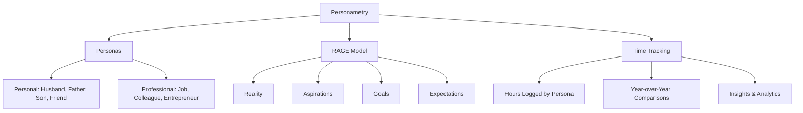

# Personametry Product Specification

**By Muhammad Khan (Product Owner)**  
_Originally authored: 2015 | Last updated: 2019_  
_Synthesized from [Google Docs specification](https://docs.google.com/document/d/1imYJ4_KSc3SK7ecD0UCQ0YCoKtSiR9uGSj0sC8Jjlqo/)_

---

## What's in a Name?

**"Personametry"** was created from **"Personal Telemetry"**.

- **Telemetry** is about measurement
- **Personal** reflects the various areas that a person may use to describe himself (e.g., Husband, Father, Professional, Friend)

> Personametry = Your own personal dashboard of life

**Registered Domains:**

- personametry.com ✓
- personametrica.com ✓

---

## The General Hypothesis

### Core Belief

People strive for contentment and purpose but often get caught in the day-to-day struggle of **"surviving"** rather than **"thriving."**

### Work-Life Integration

The philosophy moves away from "Work-Life Balance" toward **"Work-Life Integration"**, acknowledging that work is a **stream within life**, not separate from it.

### Self-Reflection

The process starts with asking **"Who Am I?"** and understanding the various "streams" (Personas) of one's life.

---

## Personametry Building Blocks

The application is built on three main pillars:

---

## 1. Personas

Personas are the first step toward self-realization. They represent the different roles we play in life.

### Personal Stream Personas

| Persona                 | Description                                            |
| ----------------------- | ------------------------------------------------------ |
| **P0 Life Constraints** | Sleep, rest, essential life functions                  |
| **P1 Muslim**           | Spiritual practices, prayer, religious observance      |
| **P2 Individual**       | Personal time, hobbies, health & fitness, learning     |
| **P3 Professional**     | Work, career development, professional growth          |
| **P4 Husband**          | Marital relationship, quality time with spouse         |
| **P5 Family**           | Family-man responsibilities, children, extended family |
| **P6 Friend/Social**    | Social connections, friendships, community             |

### Key Value System

> "Muslim | Individual | Professional (Work) | Husband | Family-Man | Social/Friend"

---

## 2. The RAGE Model

RAGE stands for **Reality, Aspirations, Goals, Expectations** - a personal development framework.

### R - Reality

- What is the current status of the situation?
- What is currently preventing you from reaching the aspiration/goal/expectation?
- A candid assessment of current problems, challenges, and worries

### A - Aspirations

Long-term desires expressed in the format:

> _"As a [Persona], I would like to [aspiration] so that I [outcome]."_

**Example Aspirations:**

- Financial independence
- Simple pleasures
- Spiritual contentment
- Fitness and wellbeing
- Entrepreneurship
- Sincere social connections

### G - Goals

The roadmap entries for long-term aspirations:

- How would you break it down?
- What milestones do you set yourself?
- Use specific, measurable goals with tangible outcomes

**Example Goals:**

- "Read 24 books a year"
- "Exercise 5 hours a week"
- "Wake up at 5am daily"

### E - Expectations

The personal commitment to achieve the goal:

- Based on the goals you've set, what expectations do you have?
- Can it be quantified (level of confidence, percentage completion by date)?
- Is the expectation realistic?

**Format:** _"I expect to achieve [X] by [time period]"_

---

## 3. Time Tracking

Time is our most valuable resource. If time is our most valuable resource, do we not owe it to ourselves to account for it?

### Current Data Collection Method

- **Tool:** [Harvest](https://www.getharvest.com/) time tracking
- **Analytics:** [Amazon QuickSight](https://aws.amazon.com/quicksight/)
- **AI Analysis:** ChatGPT, Claude, Gemini, NotebookLM

### Data Schema Fields

| Field                   | Description                 |
| ----------------------- | --------------------------- |
| `NormalisedTask`        | Specific activity category  |
| `PersonaTier2`          | High-level persona grouping |
| `MetaWorkLife`          | Work vs Life categorization |
| `StartedAt` / `EndedAt` | Time boundaries             |
| `Hours`                 | Duration logged             |
| `SocialContext`         | Social setting context      |
| `SocialEntity`          | People involved             |

### Key Analytics Questions

1. What does my typical weekday/weekend look like?
2. Which hours of the day do I usually work?
3. Am I getting enough sleep?
4. Am I overworking? (Benchmark: 168 hours/month)
5. How is my work-life balance/harmony?
6. Year-over-year persona comparisons
7. Heat maps of work hours
8. Trend analysis for each life stream

---

## Key Product Features & Use Cases

### Use Case 1: Creating Personas

Split between Personal & Work streams. Define the roles you play.

### Use Case 2: Creating Aspirations

Mapping out the "ultimate wishlist" for each persona.

### Use Case 3: Prioritise and Rank

Surfacing conflicts and making decisions on where to invest time and energy.

### Use Case 4: Breaking Aspirations into Goals

Setting specific, constrained targets with measurable outcomes.

### Use Case 5: Expectations & Habits

Setting accountabilities and tracking daily rituals:

- Wake-up times
- Journaling habits
- Exercise routines

### Use Case 6: Time Tracking

Visualizing time spent vs. goals to measure productivity and happiness.

### Use Case 7: Journaling/Timeline

A log of thoughts and reflections on the journey.

### Use Case 8: Health Progress Dashboard

- Milestones achieved
- Productivity metrics
- Overall status visualization
- Wheel of Life visualization

### Use Case 9: Cross-Platform Application

Seamless experience across web and mobile.

### Use Case 10: AI/ML/Analytics

Intelligence providing:

- Personalized recommendations
- Alerts on excessive time waste
- "Who Am I" summary generation
- Pattern detection and insights
- Coaching suggestions

### Use Case 11: Social/Sharing

Ability to share specific life streams with:

- Family members
- Mentors
- Life coaches

---

## Business and Revenue Model

### Revenue Streams

1. Connecting mentors/life coaches
2. Enterprise versions for professional development
3. Community forums

### Product Packages

| Package          | Features                                          |
| ---------------- | ------------------------------------------------- |
| **Basic/Free**   | Minimum features for progress tracking            |
| **Premium**      | Deeper analytics and advanced journaling          |
| **Professional** | Access to mentor/coach platform                   |
| **Enterprise**   | Career development and coaching for organizations |

---

## MVP Development Roadmap

### Phase 1: MVP

Focus on Use Cases 1-6:

1. ✓ Persona definition
2. ✓ Aspiration mapping
3. ✓ Priority ranking
4. ✓ Goal setting
5. ✓ Expectations tracking
6. ✓ Time tracking integration

Minimal dashboard on web and mobile.

### Phase 2: Enhanced Analytics

- AI-driven insights
- Year-over-year comparisons
- Trend visualization

### Phase 3: Social & Coaching

- Share with family/mentors
- Coach marketplace
- Community features

---

## Integration Points

### Current Tools Used

| Tool                                                    | Purpose                  |
| ------------------------------------------------------- | ------------------------ |
| [Harvest](https://www.getharvest.com/)                  | Time tracking data input |
| [Amazon QuickSight](https://aws.amazon.com/quicksight/) | Dashboard visualization  |
| [ChatGPT](https://openai.com/chatgpt/)                  | AI-driven data analysis  |
| [NotebookLM](https://notebooklm.google.com/)            | Document analysis        |

### Future Integration Opportunities

- Apple Health/HealthKit
- Wearable devices
- Calendar integrations
- Mood/sentiment tracking apps

---

## References

### Blog Posts Chronology

1. [2015: Personal Metrics - The Next Big Thing?](https://khanmjk-outlet.blogspot.com/2015/10/personal-metrics-leading-to-self-aware.html) - Original concept
2. [2016: RAGE Model for Personal Development](https://bit.ly/3CXZiMM) - Framework definition
3. [2022: Diving Deeper with Personal Analytics](https://khanmjk-outlet.blogspot.com/2022/01/diving-deeper-with-personal-analytics.html) - QuickSight experiments
4. [2023: Work/Life Balance & Harmony Update](https://khanmjk-outlet.blogspot.com/2023/01/2022-personametry-tracking-worklife.html) - 8 years of tracking
5. [2023: Personametry + ChatGPT = personametry.ai](https://khanmjk-outlet.blogspot.com/2023/07/personametry-chatgpt-personametryai.html) - AI integration
6. [2024: Quadrimester Analysis](https://khanmjk-outlet.blogspot.com/2024/05/24-personametry-first-quadrimester-jan.html) - Comparative insights
7. [2025: 2024 Results](https://khanmjk-outlet.blogspot.com/2025/01/where-did-my-time-go-in-2024-sharing-my.html) - Latest review

### Key Insights from Years of Data

- **10 years** of personal time tracking data (2015-2024)
- Consistent data collection across all life personas
- Evolution from manual tracking to AI-assisted analysis
- Validation that tracking enables intentional change
